<h1 align="left">CPU Graphics Engine</h1>

<em>A modular, real-time CPU Graphics Engine written in C.</em>

This project is designed as an educational exploration of how modern GPU graphics pipelines work — built mostly from scratch to simulate the core stages that power games, VFX, and real-time rendering system

   
  <em>Stanford Bunny rendered with Phong shading on the CPU.</em>

## Features
- **Mesh Loading:** Import `.obj` files for 3D geometry stored as meshes.
- **Texture Support:** Load `.png` files to create custom textures for materials.
- **Scene Management:** Create, save and manage scenes with **Camera**, **Light** and **GameObject** structures 
- **Programmable Shaders:** Define custom **Vertex** and **Fragment** shaders as C function pointers. 
- **Interactive Rendering:** Control scenes at runtime via **SDL2 event handling** (keyboard, mouse, etc.)
- **Transparent Graphics Pipeline:** A fully documented, step-by-step pipeline that mirrors modern GPU design — ideal for learning and debugging. *(See [Pipeline Diagram](#) for details.)* 

## Data Flow Diagram

```mermaid
%%{init: {
  "theme": "dark",
  "themeVariables": {
    "primaryColor": "#1f2937",
    "primaryTextColor": "#e5e7eb",
    "primaryBorderColor": "#4b5563",
    "lineColor": "#93c5fd",
    "tertiaryColor": "#0b1220",
    "fontFamily": "Inter, Roboto, Segoe UI, Helvetica, Arial",
    "fontSize": "14px"
  },
  "flowchart": { "curve": "basis", "nodeSpacing": 30, "rankSpacing": 60 }
} }%%

flowchart TD

APP["**App**</br>Custom Scripting, Game Loop, Event Handling, Custom Shaders"]

SM["**Scene Manager**</br>Manages Scene runtime, GameObjects, Light, Camera structures"]

AM["**Asset Manager**</br>Manages lifecycle of Material, Mesh, Scene, Texture structures"]

R["**Renderer**</br>Renders Scene structure to FrameBuffer via Graphics Pipeline"]

F["**FrameBuffer**Performs Depth Test and presents pixels to Window"]

W["**Window**Presents FrameBuffer to the screen & emits events for user input"]

APP -.Update Scene.-> SM
APP -.Load Assets.-> AM
AM -.Scene, Mesh & Material Data.-> SM
SM -.Scene Data.-> R
R -.Pixel Data.-> F
F --> W
W -.Input Events.->APP

%% ===== STYLES =====
classDef group fill:#0f172a,stroke:#4b5563,stroke-width:1px,rx:10,ry:10;
classDef Application fill:#111827,stroke:#475569,stroke-width:1px,rx:12,ry:12;
classDef Core fill:#0b1220,stroke:#3f3f46,stroke-width:1px,rx:12,ry:12;

class APP,AM,SM Application;
class R,F,W Core;	

subgraph Application
	SM
	AM
	APP
end 

subgraph Core
	R
	W
	F
end 
    style Application fill:transparent,stroke:#4b5563,stroke-width:2px,color:#f8fafc
    style Core fill:transparent,stroke:#4b5563,stroke-width:2px,color:#f8fafc
```

The architecture follows a linear data flow. User input data is first processed by the App, which updates the Scene via the Scene Manager API. The Scene Manager organizes scene structures (camera, lights, game objects) and forwards rendering data to the Renderer, which produces the final frame displayed on screen through the FrameBuffer and Window.

## Shaders Implemented (With Demos)
**TODO**
- Fragment: Garaud, Phong, Blinn-Phong, Flat, Smooth, Toon,
- Vertex: Ripple (sin), Twist, Breating / Pulsing, Fish Eye, Quantize positions 

## How it works
* See HOW_IT_WORKS.pdf which details the maths, algorithms etc.

## Installation instructions

1. Clone the reposiotry
2. Ensure you have dependencies installed
3. Run the following commands to get started
4. Instructions for Custom Scenes, Shaders, .obj files, .png files, etc.

Windows (WSL):  
sudo apt update  
sudo apt install build-essential -y  
sudo apt install libsdl2-dev  

Mac:  
brew install gcc make  
brew install sdl2  

Verify dependencies:  
gcc --version  
make --version  
sdl2-config --version  
