```mermaid
flowchart TD

APP["**App**</br>Custom Scripting, Game Loop"]

SM["**Scene Manager**</br>Manages Scene runtime"]

AM["**Asset Manager**</br>Material, Mesh, Scene, Texture structures"]

R["**Renderer**</br>Renders Scene to FrameBuffer"]

F["**FrameBuffer**</br>Depth Test & presents to Window"]

W["**Window**</br>Handles Hardware & Events"]

APP -.Update Scene.-> SM
APP -.Load Assets.-> AM
AM -.Scene, Mesh & Material Data.-> SM
SM -.Scene Data.-> R
R -.Pixel Data.-> F
F --> W
W -.Input Events.->APP

%% ===== STYLES =====
classDef Application fill:#111827,stroke:#475569,stroke-width:1px,rx:12,ry:12;
classDef Core fill:#0b1220,stroke:#3f3f46,stroke-width:1px,rx:12,ry:12;

class APP,AM,SM Application;
class R,F,W Core;	

subgraph Application
	SM
	AM
	APP
end 

subgraph Core
	R
	W
	F
end 
    style Application fill:transparent,stroke:#4b5563,stroke-width:2px,color:#f8fafc
    style Core fill:transparent,stroke:#4b5563,stroke-width:2px,color:#f8fafc
```

<h1 align="left">CPU Graphics Engine</h1>

<em>A modular, real-time CPU Graphics Engine written in C.</em>

This project is an educational exploration of how modern GPU graphics pipelines work. It's built mostly from scratch to simulate the core stages that power games, VFX, and real-time rendering system.

   
  <em>Stanford Bunny rendered with Phong shading</em>

## Features
- **Mesh Loading:** Import `.obj` files for 3D geometry stored as meshes.
- **Texture Support:** Load `.png` files to create custom textures for materials.
- **Scene Management:** Create, save and manage scenes with **Camera**, **Light** and **GameObject** structures 
- **Programmable Shaders:** Define custom **Vertex** and **Fragment** shaders as C function pointers. 
- **Interactive Rendering:** Control scenes at runtime via **SDL2 event handling** (keyboard, mouse, etc.)
- **Transparent Graphics Pipeline:** A fully documented, step-by-step pipeline that mirrors modern GPU design — ideal for learning and debugging. *(See [Pipeline Diagram](#) for details.)* 

## Architecture
### Design Philosophy
To separate user scripting and backend rendering logic, the engine uses an **App/Core architecture**.

### Components
- **App Layer** – Provides the API surface for scripting, game loops, and scene logic.  
- **Core Layer** – Implements low-level graphics pipeline and system operations.  
- **Asset Manager** – API for managing lifecycle of material, mesh, scene, and texture data shared between App and Core.
- **Scene Manager** - API for handling Scene creation and update rules

### Flow Summary
- In the App Layer, the user creates or loads a Scene via the Scene Manager.
- To add objects to the scene to render, we first need to build the required assets (Textures, Materials, Meshes) which is done via the Asset Manager.
- Once ready, GameObjects can be constructed and added to the Scene. GameObjects contain a Transform which tells us where it is in the Scene, a Mesh which tells us its geometry and a Material which tells us how to render it.
- The user also specifies the rules for how the Scene components (Camera, Light, GameObjects) should evolve with time inside the Render Loop, factoring in User Input Events from the Window.
- Each iteration of the Render Loop, the user can call the draw_scene function via the Render API to execute Core Layer code which renders the scene to the screen.
### Data Flow Diagram

<em>
This diagram shows the flow of data throughout the components of the program. In the Application Layer, the Assets and Scene are prepared. Rules are also specified for how the Scene should update in time. In the Core Layer, Scene Data is handed off to the Renderer which processes it through the Graphics Pipeline before it is written to the FrameBuffer and presented to the Window.

## Shaders Implemented (With Demos)
**TODO**
- Fragment: Garaud, Phong, Blinn-Phong, Flat, Smooth, Toon,
- Vertex: Ripple (sin), Twist, Breating / Pulsing, Fish Eye, Quantize positions 

## How it works
* See [HOW_IT_WORKS.pdf](./docs/latex/main.pdf) which details the maths, algorithms etc.

## Installation instructions

1. Clone the reposiotry
2. Ensure you have dependencies installed
3. Run the following commands to get started
4. Instructions for Custom Scenes, Shaders, .obj files, .png files, etc.

Windows (WSL):  
sudo apt update  
sudo apt install build-essential -y  
sudo apt install libsdl2-dev  

Mac:  
brew install gcc make  
brew install sdl2  

Verify dependencies:  
gcc --version  
make --version  
sdl2-config --version  
