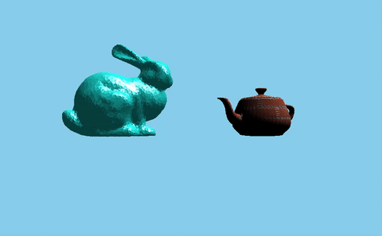

<h1 align="left">CPU Graphics Engine</h1>

<em>A modular, real-time CPU Graphics Engine written in C.</em>

3D Graphics done on the CPU, not GPU. <em>"Why?"</em>, you may be asking. Put simply: GPU complicated, CPU less complicated. Plus I have a full graphics pipeline that I can play around with now! If you're curious about how it works, check out [HOW_IT_WORKS.pdf](./docs/latex/main.pdf).

<em>Stanford Bunny rendered with Phong shading and Utah Teapot rendered with Garaud shading & a brick texture applied</em>

## Features
- **Mesh Loading:** Import `.obj` files for 3D geometry stored as meshes.
- **Texture Support:** Load `.png` files to create custom textures for materials.
- **Scene Management:** Create, save and manage scenes with **Camera**, **Light** and **GameObject** structures 
- **Programmable Shaders:** Define custom **Vertex** and **Fragment** shaders as C function pointers. 
- **Interactive Rendering:** Control scenes at runtime via **SDL2 event handling** (keyboard, mouse, etc.)
- **Transparent Graphics Pipeline:** A fully documented, step-by-step pipeline that mirrors modern GPU design — ideal for learning and debugging. *(See [Pipeline Diagram](#) for details.)* 

## System Design
I use an **App/Core** architecture to separate application-specific user scripting from the static core library. 

### Core Components
- **Application**: API for user to inject custom scripting in the core render loop through V-table call-backs.
- **Game Math**: A math library with little to no dependencies used throughout the engine.
- **Platform**: Abstracts system calls and calls to SDL2 to supply time data, a window and input events.
- **Asset Manager**: API for user to load Meshes, Materials and Scenes into memory
- **Scene Manager**: API for user to create, modify, save and destroy Scene structures which contain GameObjects, Camera and Light structures.
- **Renderer**: Software Implementation of the Graphics Pipeline which supports custom Vertex and Fragment Shaders as C fptrs.

### Data Flow Diagram

## How it works
* See [HOW_IT_WORKS.pdf](./docs/latex/main.pdf) which details the maths, algorithms etc.

## Installation instructions

1. Clone the reposiotry
2. Ensure you have dependencies installed
3. Run the following commands to get started
4. Instructions for Custom Scenes, Shaders, .obj files, .png files, etc.

Windows (WSL):  
sudo apt update  
sudo apt install build-essential -y  
sudo apt install libsdl2-dev  

Mac:  
brew install gcc make  
brew install sdl2  

Verify dependencies:  
gcc --version  
make --version  
sdl2-config --version  
